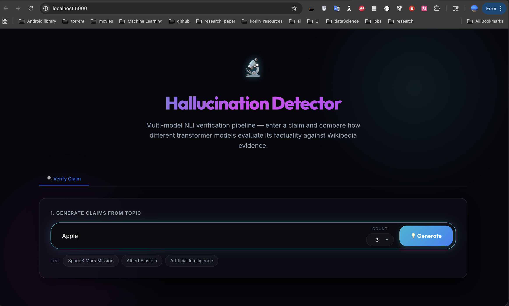
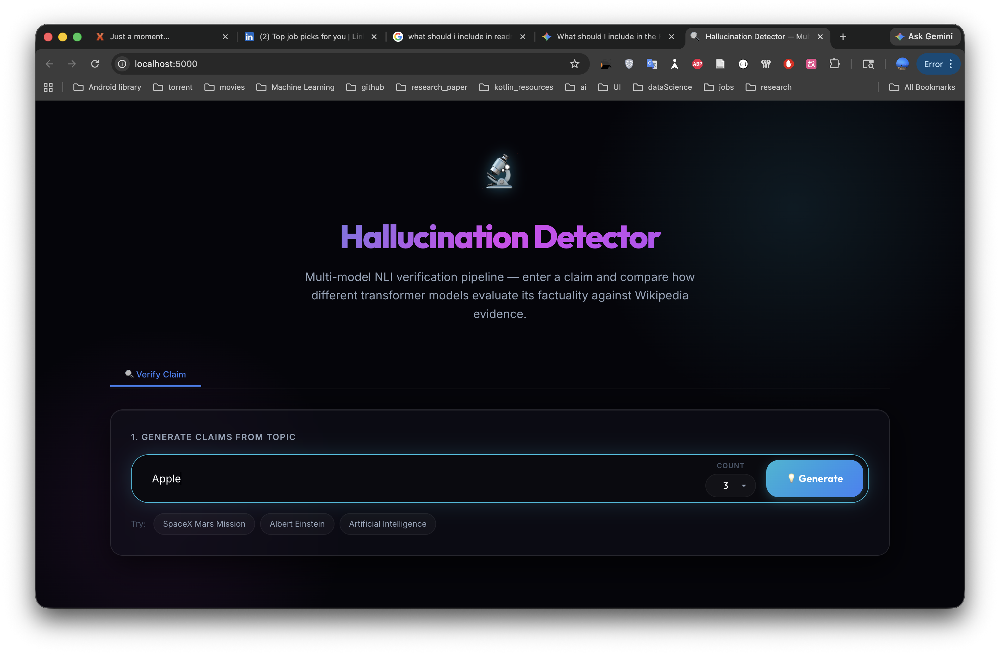
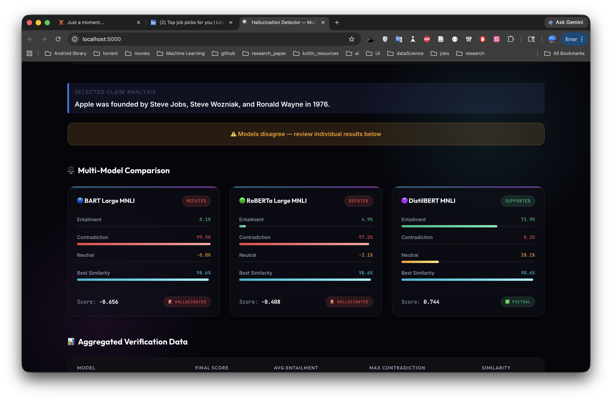
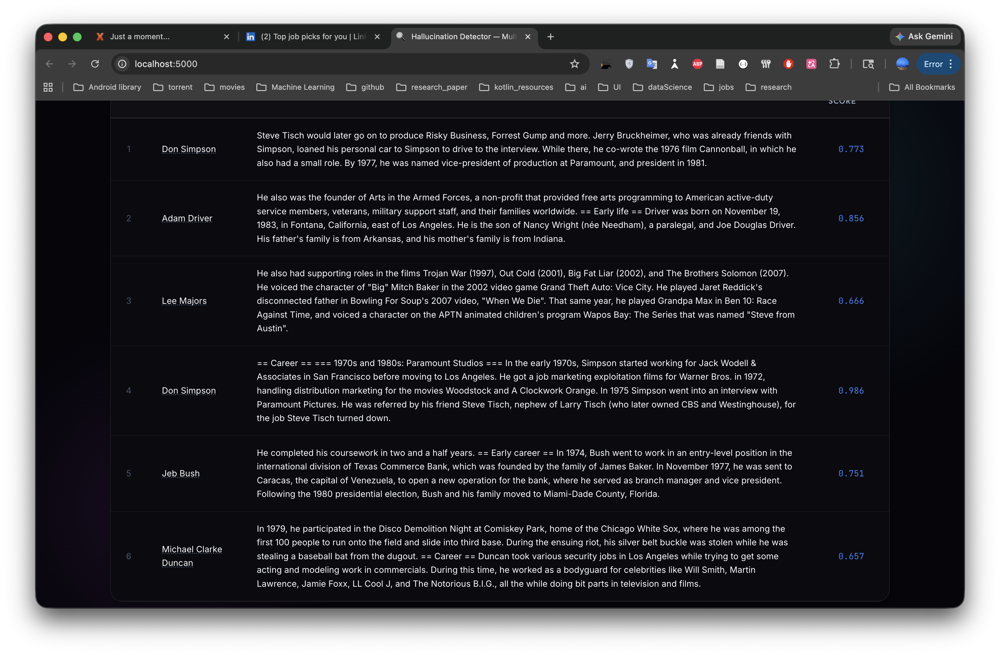

# 🔍 Hallucination Detection in LLMs

[](https://www.python.org/)
[](https://pytorch.org/)
[](https://huggingface.co/)
[](https://flask.palletsprojects.com/)
[](https://github.com/facebookresearch/faiss)
[](LICENSE)

---

## 📌 Overview

**Hallucination Detection in LLMs** is an automated, multi-model verification pipeline that detects hallucinations (factually incorrect claims) in Large Language Model (LLM) outputs. The system combines **Natural Language Inference (NLI)** models with **dense evidence retrieval** (FAISS) to verify claims against a Wikipedia knowledge base.

This project was developed as part of **CSCI 642: Natural Language Processing** and includes:
- A **production-ready Flask Web UI** for interactive claim verification
- **Multi-model ensemble** comparison (3 different NLI transformers)
- **Configurable experimental pipelines** for precision-recall trade-off analysis
- **Comprehensive evaluation metrics** (Accuracy, Precision, Recall, F1, NDCG)

### 🎨 UI Preview


*The beautiful, modern dashboard featuring the claim generation interface*

---

## ✨ Key Features

- **🧠 Multi-Model NLI Verification**: Compares predictions across:
  - `facebook/bart-large-mnli` (BART Large MNLI)
  - `roberta-large-mnli` (RoBERTa Large MNLI)
  - `typeform/distilbert-base-uncased-mnli` (DistilBERT MNLI)

- **⚡ Dense Evidence Retrieval**: Fast semantic search using:
  - **FAISS (CPU-optimized)** for scalable document indexing
  - **Sentence-Transformers** (`all-MiniLM-L6-v2`) for embeddings

- **🎨 Interactive Web Dashboard**: Flask-based UI featuring:
  - Real-time claim verification
  - Multi-model comparison cards with visual consensus indicators
  - Detailed evidence table with Retriever Scores
  - Aggregated verification metrics

- **⚙️ Configurable Experiments**: Four distinct experimental configurations:
  - **Baseline** (balanced): `top_k=5`, `similarity_threshold=0.60`
  - **High Recall** (aggressive): `top_k=15`, lower thresholds
  - **NLI-Focused**: Enhanced NLI scoring, reduced retrieval weight
  - **Strict** (conservative): High confidence thresholds, fewer false positives

- **📊 Comprehensive Evaluation**: Metrics include:
  - Classification Metrics: Accuracy, Precision, Recall, F1-Score
  - NLI Metrics: Entailment/Contradiction/Neutral probabilities
  - Retrieval Quality: NDCG, Mean Reciprocal Rank (MRR)
  - Cross-Model Consistency: Agreement rates and consensus voting

---

## 🛠 Tech Stack

| Component | Technology | Purpose |
|-----------|-----------|---------|
| **Language** | Python 3.8+ | Backend logic and ML pipeline |
| **Web Framework** | Flask 2.0+ | REST API and Web UI hosting |
| **NLP/ML** | PyTorch + HuggingFace Transformers | NLI model inference |
| **Embeddings** | Sentence-Transformers | Dense text vectorization |
| **Retrieval** | FAISS (CPU) | Efficient similarity search at scale |
| **Frontend** | HTML5, CSS3, JavaScript | Interactive user interface |
| **Data** | FEVER Dataset, Wikipedia Corpus | Training and evaluation data |

---

## 📦 Installation & Getting Started

### Prerequisites
- Python 3.8 or higher
- ~4 GB RAM (for model loading)
- ~500 MB disk space (for FAISS index + models)

### Step 1: Clone the Repository
```bash
git clone https://github.com/Shariq80/hallucination-detection-llm.git
cd hallucination-detection-llm
```

### Step 2: Create Virtual Environment
```bash
python3 -m venv .venv
source .venv/bin/activate          # On Windows: .venv\Scripts\activate
```

### Step 3: Install Dependencies
```bash
pip install -r requirements.txt
```

### Step 4: Build the Retrieval Index
Download Wikipedia pages and construct the FAISS index (one-time setup):
```bash
python -m src.scripts.build_index
```

### Step 5: Launch the Web UI
```bash
python app.py
```

The server will start at:
- **Local**: `http://localhost:5000`
- **Network**: `http://192.168.x.x:5000` (check terminal output)

---

## 🎯 Usage

### Via Web Dashboard (Recommended)
1. Open your browser to `http://localhost:5000`
2. Enter a topic (e.g., "Mars Exploration", "Quantum Computing")
3. Adjust the number of claims to generate (1–10)
4. Click **💡 Generate** to create claims
5. Click **⚡ Fact-Check All** to run verification
6. Inspect detailed results including:
   - Multi-model comparison cards
   - Consensus verdicts
   - Retrieved evidence with Retriever Scores
   - Aggregated verification metrics


*Step 1: Enter a topic and generate atomic claims*


*Step 2: Review generated claims before verification*

### Via Python API
```python
from src.pipeline.pipeline import HallucinationPipeline
from src.claim_generator import generate_claims

# Generate claims from a topic
topic = "Space Exploration"
claims = generate_claims(topic, n_claims=3)

# Verify claims
pipeline = HallucinationPipeline(config_path="configs/default.yaml")
for claim in claims:
    results = pipeline.verify_claim(claim)
    print(f"Claim: {claim}")
    print(f"Verdict: {results['final_decision']['label']}")
    print(f"Hallucinated: {results['final_decision']['hallucinated']}")
```

### Via Command Line (Batch Processing)
```bash
python -m src.evaluation.evaluate --config configs/exp1_baseline.yaml
```

---

## 📊 Project Structure

```
hallucination-detection-llm/
├── app.py                          # Flask web server entry point
├── requirements.txt                # Python dependencies
├── pyrightconfig.json              # Pylance configuration
│
├── configs/                        # Experiment configurations (YAML)
│   ├── default.yaml
│   ├── config_small.yaml
│   ├── exp1_baseline.yaml          # Balanced config
│   ├── exp2_high_recall.yaml       # Aggressive retrieval
│   ├── exp3_nli_focused.yaml       # NLI-centric scoring
│   └── exp4_strict.yaml            # Conservative thresholds
│
├── data/
│   ├── raw/                        # Original FEVER dataset dumps
│   │   ├── fever_train.jsonl
│   │   └── fever_dev.jsonl
│   └── processed/                  # Cleaned and prepared data
│       ├── fever_train.jsonl
│       ├── fever_dev.jsonl
│       ├── wiki_pages.json
│       └── wiki_titles.json
│
├── indexes/                        # FAISS retrieval index
│   ├── faiss.index                 # Dense vector index
│   └── metadata.pkl                # Document metadata
│
├── results/                        # Evaluation outputs
│   ├── exp1_baseline.json
│   ├── exp2_high_recall.json
│   ├── exp3_nli_focused.json
│   ├── exp4_strict.json
│   └── previous/                   # Previous experiment runs
│
├── src/
│   ├── main.py                     # CLI entry point
│   ├── app.py                      # Flask blueprints (if modular)
│   ├── claim_generator.py          # LLM-based claim generation (Gemini API)
│   ├── verify_claim.py             # Main verification orchestrator
│   │
│   ├── data/                       # Data loading & preprocessing
│   │   ├── prepare_fever.py
│   │   └── wiki_pages.py
│   │
│   ├── retrieval/                  # Evidence retrieval module
│   │   ├── build_index.py          # FAISS index construction
│   │   ├── preprocessing.py        # Text cleaning & chunking
│   │   └── retrieval.py            # Query and retrieve logic
│   │
│   ├── verification/               # NLI and aggregation
│   │   ├── nli.py                  # NLI model wrapper
│   │   ├── aggregator.py           # Score aggregation & voting
│   │   └── compare_nli_similarity.py
│   │
│   ├── similarity/                 # Semantic similarity scoring
│   │   ├── similarity.py
│   │   └── tune_similarity.py
│   │
│   ├── evaluation/                 # Evaluation & metrics
│   │   ├── evaluate.py             # Batch evaluation script
│   │   └── test_dataset.py
│   │
│   ├── pipeline/                   # Main orchestration
│   │   └── pipeline.py             # HallucinationPipeline class
│   │
│   ├── utils/                      # Utilities
│   │   ├── config.py               # YAML config loader
│   │   ├── atomic_claims.py        # Claim decomposition
│   │   └── retrieve_evidence.py
│   │
│   └── scripts/                    # One-off utilities
│       └── build_index.py
│
├── static/                         # Frontend assets
│   ├── app.js                      # UI interactivity & API calls
│   └── style.css                   # Styling (dark theme)
│
├── templates/                      # HTML templates
│   └── index.html                  # Main dashboard
│
├── tests/                          # Unit tests
│   ├── test_nli.py
│   └── test_similarity.py
│
└── docs/                           # Documentation
    └── architecture/
        └── system_architecture.drawio
```

---

## 🔄 System Pipeline

```
┌─────────────────────────────────────────────────────────────┐
│  Input: Topic or LLM-Generated Text                          │
└──────────────────────┬──────────────────────────────────────┘
                       ↓
        ┌──────────────────────────────┐
        │  1. Claim Extraction         │
        │  (Atomic decomposition)      │
        └──────────────┬───────────────┘
                       ↓
        ┌──────────────────────────────┐
        │  2. Evidence Retrieval       │
        │  (FAISS dense search)        │
        └──────────────┬───────────────┘
                       ↓
        ┌──────────────────────────────┐
        │  3. NLI Verification         │
        │  (3 transformer models)      │
        └──────────────┬───────────────┘
                       ↓
        ┌──────────────────────────────┐
        │  4. Similarity Scoring       │
        │  (Semantic coherence)        │
        └──────────────┬───────────────┘
                       ↓
        ┌──────────────────────────────┐
        │  5. Score Aggregation        │
        │  (Multi-model consensus)     │
        └──────────────┬───────────────┘
                       ↓
┌─────────────────────────────────────────────────────────────┐
│  Output: Verdict (SUPPORTED / REFUTED / NOT ENOUGH INFO)    │
│          Confidence Score & Best Evidence                   │
└─────────────────────────────────────────────────────────────┘
```

---

## 📈 Evaluation Metrics

The project tracks the following performance indicators:

### Classification Metrics
- **Accuracy**: Overall correctness across all verdicts
- **Precision**: Of predicted hallucinations, how many were correct?
- **Recall**: Of actual hallucinations, how many did we catch?
- **F1-Score**: Harmonic mean balancing precision and recall

### NLI Metrics
- **Avg Entailment**: Average "entailment" probability across evidence
- **Max Contradiction**: Strongest contradiction signal detected
- **Neutral Score**: Default reasoning when neither entailment nor contradiction is clear

### Retrieval Quality
- **NDCG (Normalized Discounted Cumulative Gain)**: Ranking quality of retrieved evidence
- **Mean Reciprocal Rank (MRR)**: Position of first relevant evidence
- **Retriever Score**: FAISS similarity score (0–1 scale)

### Cross-Model Consistency
- **Agreement Rate**: % of claims where all 3 models agree
- **Consensus Verdict**: Majority voting outcome

---

## 🚀 Quick Examples

### Example 1: Generate and Verify Claims
```bash
python app.py
# Then open http://localhost:5000 in browser
# 1. Enter topic: "Albert Einstein"
# 2. Generate 3 claims
# 3. Click "Fact-Check All"
# Results show multi-model comparison + evidence table
```


*All 3 NLI models (BART, RoBERTa, DistilBERT) evaluated side-by-side with consensus indicator*


*Aggregated metrics table and Retrieved Evidence with Retriever Scores (the new column!)*

### Example 2: Run Batch Evaluation
```bash
# Evaluate using the strict configuration
python -m src.evaluation.evaluate --config configs/exp4_strict.yaml

# Results saved to: results/exp4_strict.json
```

### Example 3: Custom Python Script
```python
from src.pipeline.pipeline import HallucinationPipeline

# Load pipeline with custom config
pipeline = HallucinationPipeline(config_path="configs/exp2_high_recall.yaml")

# Verify a single claim
result = pipeline.verify_claim("The Earth orbits the Sun in 365 days.")
print(f"Hallucinated: {result['final_decision']['hallucinated']}")
print(f"Best Evidence: {result['final_decision']['best_evidence']['text']}")
```

---

## 🔮 Future Work & Roadmap

### Phase 2: Enhanced Fact-Checking
- [ ] **Multi-Hop Reasoning**: Support claims requiring 2+ reasoning steps across documents
- [ ] **Temporal Reasoning**: Handle time-dependent facts (e.g., "X was president in 2020")
- [ ] **Numerical Reasoning**: Validate mathematical claims and statistical facts
- [ ] **Coreference Resolution**: Better handling of pronoun-based claims

### Phase 3: Production Deployment
- [ ] **Model Quantization**: Reduce model size for edge deployment (ONNX, TensorRT)
- [ ] **API Rate Limiting**: Implement rate limits and authentication for public APIs
- [ ] **Caching Layer**: Redis-based caching for frequently checked claims
- [ ] **Monitoring & Alerting**: Track system performance and model drift over time

### Phase 4: Dataset Expansion
- [ ] **Multi-Language Support**: Extend to Spanish, Chinese, French, Arabic
- [ ] **Domain-Specific Datasets**: Medical facts, legal claims, scientific papers
- [ ] **Real-Time LLM Integration**: Hook into ChatGPT/Claude output streams for live verification

---

## 📸 Screenshots & Visual Walkthrough

See the full user journey:

| Step | Screenshot | Description |
|------|-----------|-------------|
| **1** | Landing | Hero dashboard with subtitle |
| **2** | Generate | Topic input & claim generation |
| **3** | Claims Table | List of generated claims |
| **4** | Multi-Model | Side-by-side NLI model results |
| **5** | Evidence | Evidence table with Retriever Scores |
| **6** | Metrics | Aggregated verification metrics |

---

## 🧪 Testing

Run the test suite to verify functionality:
```bash
# Unit tests for NLI module
python -m pytest tests/test_nli.py -v

# Unit tests for similarity module
python -m pytest tests/test_similarity.py -v

# All tests
python -m pytest tests/ -v
```

---

## 📚 References & Citations

1. **FEVER Dataset**: Thorne, J., et al. (2018). *FEVER: a large-scale dataset for Fact Extraction and VERification*. EMNLP.
2. **FAISS**: Johnson, J., Douze, M., & Jégou, H. (2019). *Billion-scale similarity search with GPUs*. IEEE ICCV.
3. **BART-Large-MNLI**: Lewis, M., et al. (2019). *BART: Denoising Sequence-to-Sequence Pre-training for Natural Language Generation, Translation, and Comprehension*. ACL.
4. **Sentence-Transformers**: Reimers, N., & Gurevych, I. (2019). *Sentence-BERT: Sentence Embeddings using Siamese BERT-Networks*. EMNLP.
5. **NLI Task**: Dagan, I., et al. (2009). *The Recognizing Textual Entailment Challenge*. TAC.

---

## 👨‍💻 Contributing

Contributions are welcome! Please follow these steps:

1. Fork the repository
2. Create a feature branch (`git checkout -b feature/amazing-feature`)
3. Commit your changes (`git commit -m 'Add amazing feature'`)
4. Push to the branch (`git push origin feature/amazing-feature`)
5. Open a Pull Request

---

## 📜 License

This project is licensed under the **MIT License**. See [LICENSE](LICENSE) for details.

---

## 📧 Contact & Support

- **GitHub**: [@Shariq80](https://github.com/Shariq80)
- **Repository**: [hallucination-detection-llm](https://github.com/Shariq80/hallucination-detection-llm)
- **Issues**: Please file bugs and feature requests via [GitHub Issues](https://github.com/Shariq80/hallucination-detection-llm/issues)

---

## 🙏 Acknowledgments

- **CSCI 642 Instructors** for project guidance and feedback
- **HuggingFace** for pre-trained transformer models
- **Facebook Research** for FAISS retrieval library
- **FEVER Dataset Authors** for comprehensive fact verification benchmark

---

**Last Updated**: April 2026  
**Maintainer**: [@Shariq80](https://github.com/Shariq80)

